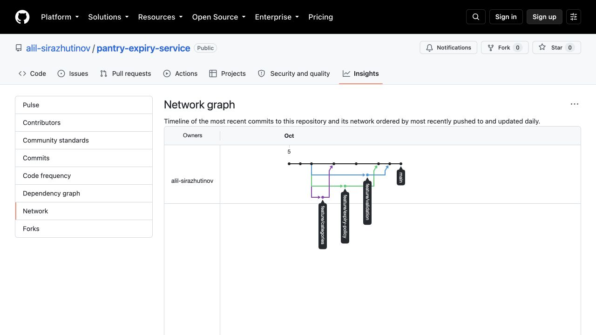

# Pantry Expiry Service — учёт сроков годности продуктов

Индивидуальная проектная тема: **сервис учёта сроков годности домашних продуктов**.

Сервис помогает вести домашние запасы, видеть продукты с близким сроком годности
и уменьшать количество выброшенной еды. Тема предназначена для дальнейших практик:
Git → Linux → Docker → Docker Compose → Архитектура → Финальный проект.

На этапе Git подготовлены документы проекта и история разработки.
Реализация сервера запланирована для следующих практик.

## Структура

- `project-notes.md` — цель, сущности и правила MVP.
- `api-plan.md` — проект REST API.
- `categories.md` — категории и места хранения.
- `expiry-examples.md` — примеры расчёта срока годности.
- `git-conflict.md` — возникновение и ручное разрешение конфликта.
- `defense.md` — рассказ и команды для защиты.
- `git-network.png` — скриншот настоящего графа GitHub Network.

## GitHub

[Публичный репозиторий](https://github.com/alil-sirazhutinov/pantry-expiry-service).
[Граф GitHub Network](https://github.com/alil-sirazhutinov/pantry-expiry-service/network).

Уникальность темы в учебной группе нужно подтвердить у преподавателя:
данных о темах других студентов в репозитории нет.

## Git workflow и критерии

| Требование | Результат |
|---|---|
| Коммиты | Более 6 осмысленных коммитов: тема, сущности, API, категории, предупреждения, валидация, слияния и отчёт |
| Ветки | `main`, `feature/categories`, `feature/expiry-policy`, `feature/validation` |
| Merge в main | `14b8c5a` — категории, `d190a4f` — политика сроков, `790dbf4` — валидация |
| Конфликт | Одна строка project-notes.md; разрешён отдельным коммитом `d190a4f` |
| Описание конфликта | [git-conflict.md](git-conflict.md) |
| Граф веток | [GitHub Network](https://github.com/alil-sirazhutinov/pantry-expiry-service/network), проверен 05.10.2026 |
| Защита | [defense.md](defense.md) |

## Ссылка для сдачи

[https://github.com/alil-sirazhutinov/pantry-expiry-service](https://github.com/alil-sirazhutinov/pantry-expiry-service)

## Скриншот GitHub Network

Снимок сделан после публикации веток; последний коммит со снимком может отсутствовать на нём.
